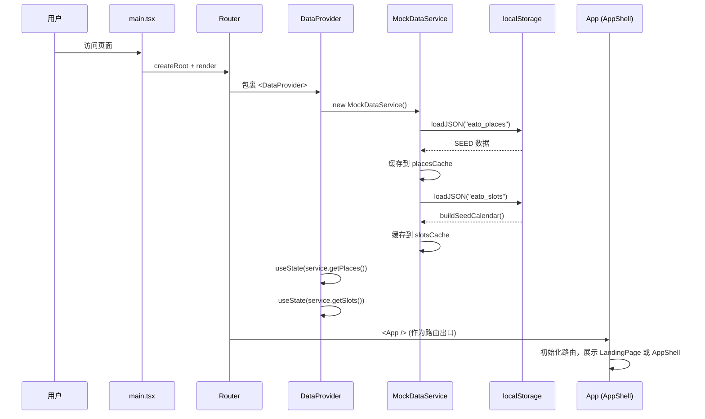
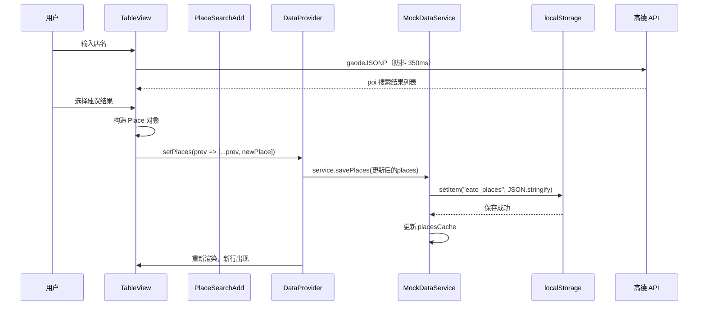
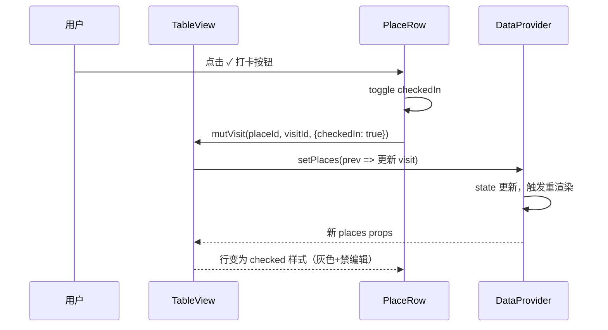
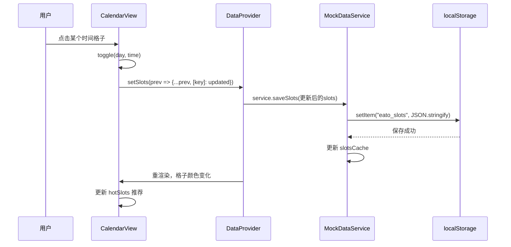
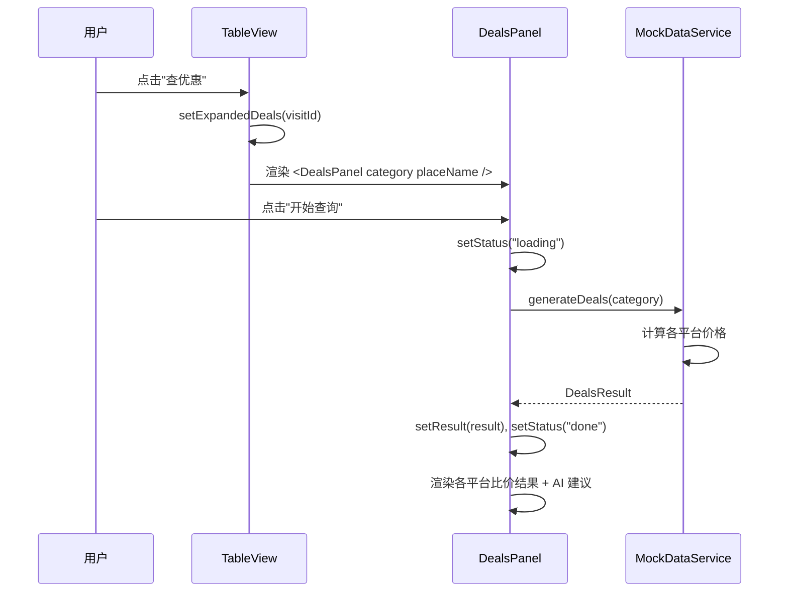
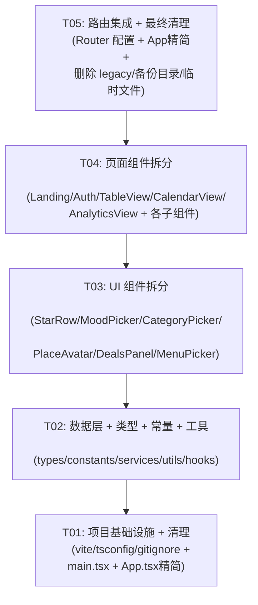

# Eato 约饭打卡App — 架构重构方案

> 作者：Bob（架构师）  
> 日期：2026-07-22  
> 状态：v1 方案稿，待主理人审阅

---

## Part A: 系统设计

### 1. 实现思路

#### 1.1 核心难点分析

| 难点 | 描述 | 应对策略 |
|------|------|---------|
| **双代码线合并** | 新版 App.tsx 内联了所有组件，legacy 有拆好的版本但类型体系不一致（8类 vs 9类） | **废弃 legacy**，以新版 App.tsx 的功能和类型为准。参考 legacy 的分解思路但不复用其实现代码 |
| **App.tsx 1398行大怪物** | 包含9个内联组件 + 路由逻辑 + 状态管理 | 按页面/功能拆分为独立文件，每个组件职责单一 |
| **状态管理散乱** | 状态在 App 层用 `useState` 管理，通过 props 层层传递 | 引入 legacy 中的 `DataProvider` 模式（已被证明有效），统一数据流 |
| **无路由系统** | 当前用 `screen` + `tab` 状态变量模拟路由 | 升级为 `react-router`（已在 package.json 中）实现声名式路由 |
| **类型双重定义** | `src/types/index.ts` 与 `src/legacy/types/index.ts` 不同 | 统一到新版类型，删除 legacy 类型 |

#### 1.2 框架与库选择

| 库 | 用途 | 理由 |
|----|------|------|
| React 18 + TypeScript 5 | UI框架 | 已在项目中 |
| Vite 6 | 构建工具 | 已在项目中，配置不变 |
| Tailwind CSS 4 | 样式 | 已在项目中 |
| react-router@7 | 路由 | 已在 package.json 中，取代手动 screen/tab 管理 |
| Recharts | 图表 | 已在 AnalyticsView 中使用 |
| lucide-react | 图标 | 已在项目中使用 |

#### 1.3 架构模式

采用 **分层架构 + Context Provider 数据层**：

```
┌─────────────────────────────────────────┐
│             路由层 (Router)               │
│  / → LandingPage  /auth → AuthPage      │
│  /app → AppShell (内部 Tab 导航)          │
└──────────────┬──────────────────────────┘
               │
┌──────────────▼──────────────────────────┐
│          页面组件 (Pages)                 │
│  LandingPage / AuthPage / AppShell      │
│  TableView / CalendarView / AnalyticsView│
└──────────────┬──────────────────────────┘
               │
┌──────────────▼──────────────────────────┐
│         业务组件 (Components)             │
│  StarRow / MoodPicker / CategoryPicker  │
│  DealsPanel / MenuPicker / PlaceRow     │
│  StatCard / CalendarGrid / ...          │
└──────────────┬──────────────────────────┘
               │
┌──────────────▼──────────────────────────┐
│         数据层 (DataProvider)             │
│  DataProvider + useData() hook          │
│  MockDataService / ApiDataService       │
└──────────────┬──────────────────────────┘
               │
┌──────────────▼──────────────────────────┐
│        工具层 (Utils / Hooks)            │
│  avatar.ts / poi.ts / format.ts         │
│  usePersistState / helpers              │
└─────────────────────────────────────────┘
```

---

### 2. 文件清单

```
eato/
├── index.html
├── package.json
├── tsconfig.json
├── vite.config.ts
├── .gitignore
├── .env
├── .env.example
├── README.md
├── API_DOCS.md
├── ATTRIBUTIONS.md
├── public/
│   └── ... (原有文件，不动)
├── server/                              # 后端（不动）
│   └── ...
├── docs/
│   ├── system_design.md                 # 本文件
│   ├── class-diagram.mermaid
│   └── sequence-diagram.mermaid
│
└── src/
    ├── main.tsx                         # 入口（增加 Router 包裹）
    ├── vite-env.d.ts
    │
    ├── types/
    │   └── index.ts                     # 统一类型定义（保留新版9类体系）
    │
    ├── constants/
    │   └── index.ts                     # 从 legacy 迁移：BRAND, CAT, MOOD, PLATFORMS, USERS, PIE_COLORS, DAYS 等
    │                                    # └ 注意：CAT 继承 App.tsx 的9类体系，不是 legacy 的8类
    │
    ├── data/
    │   ├── catalog.ts                   # 精简：仅保留 generateDeals + DISH_DB（菜单数据库）
    │   └── catalog_dish_db_only.ts      # 不动
    │
    ├── utils/
    │   ├── avatar.ts                    # brandAvatar, resolvePlaceImage（已有，微调）
    │   ├── poi.ts                       # gaodeJSONP（已有，微调）
    │   ├── format.ts                    # 从 legacy 迁移：formatPrice, formatDateCN, now 等
    │   ├── helpers.ts                   # 从 legacy 迁移：cn, clamp, debounce, shuffle 等
    │   └── id.ts                        # 从 legacy 迁移：generateId, shortId
    │
    ├── hooks/
    │   ├── usePersistState.ts           # 从 legacy 迁移
    │   └── useDebounce.ts               # 新增：防抖 hook（替代 TableView 内联的 debounce）
    │
    ├── services/
    │   ├── types.ts                     # DataService 接口（从 legacy 迁移）
    │   ├── mockDataService.ts           # 从 legacy 迁移，调整为9类体系
    │   ├── apiDataService.ts            # 从 legacy 迁移
    │   └── DataProvider.tsx             # 从 legacy 迁移，统一数据 Context
    │
    ├── styles/
    │   ├── index.css                    # 入口样式（已存在）
    │   ├── tailwind.css                 # Tailwind 配置（已存在）
    │   ├── theme.css                    # 主题变量（已存在）
    │   └── fonts.css                    # 字体（已存在）
    │
    ├── components/                      # ── 可复用 UI 组件 ──
    │   ├── ui/
    │   │   ├── StarRow.tsx              # 星级评分（从 App.tsx 拆出）
    │   │   ├── MoodPicker.tsx           # 心情选择器（从 App.tsx 拆出，保留已有 MenuPicker 平级）
    │   │   └── CategoryPicker.tsx       # 分类选择器（从 App.tsx 拆出）
    │   ├── MenuPicker.tsx               # 菜单选择器（已存在，不动）
    │   ├── DealsPanel.tsx               # 比价面板（从 App.tsx 拆出）
    │   └── PlaceAvatar.tsx              # 地点头像（从 TableView 拆出）
    │
    ├── pages/                           # ── 页面级组件 ──
    │   ├── LandingPage.tsx              # 落地页（从 App.tsx 拆出）
    │   ├── AuthPage.tsx                 # 登录注册页（从 App.tsx 拆出）
    │   ├── TableView.tsx                # 打卡表（从 App.tsx 拆出）
    │   ├── TableViewComponents.tsx      # TableView 的子组件：PlaceRow, PlaceSearchAdd, EditableField
    │   ├── CalendarView.tsx             # 约饭日历（从 App.tsx 拆出）
    │   ├── CalendarViewComponents.tsx   # CalendarView 的子组件：CalendarGrid, CalendarHeader, CalendarLegend
    │   ├── AnalyticsView.tsx            # 数据分析（从 App.tsx 拆出）
    │   └── AnalyticsViewComponents.tsx  # AnalyticsView 的子组件：StatCard, KpiCards, SpendingChart, MonthlyChart
    │
    ├── app/
    │   └── App.tsx                      # 精简为路由配置 + AppShell 框架组件
    │
    └── legacy/                          # ── 过渡期保留，重构完成后删除 ──
        └── ...                          # 保留不动，重构完成后整目录删除
```

**文件总计（新增/修改）：~25 个文件**（不含 legacy）

---

### 3. 数据结构和接口

```mermaid
classDiagram
    %% ── Data Models ──
    class AppState {
        <<enum>>
        "landing" | "auth" | "app"
    }
    class AuthMode {
        <<enum>>
        "login" | "signup"
    }
    class Tab {
        <<enum>>
        "table" | "calendar" | "analytics"
    }
    class Category {
        <<enum>>
        "hotpot" | "chinese" | "fastfood" | "asian" | "western" | "bbq" | "dessert" | "seafood" | "other"
    }
    class Mood {
        <<enum>>
        "must" | "excited" | "curious" | "casual"
    }
    class Visit {
        +id: string
        +date: string
        +time: string
        +checkedIn: boolean
        +spending: string
        +review: string
    }
    class Place {
        +id: string
        +name: string
        +image: string
        +stars: number
        +category: Category
        +mood: Mood
        +plannedMenu: string
        +visits: Visit[]
    }
    class Dish {
        +id: string
        +name: string
        +image: string
        +emoji: string
        +rating: number
        +reviewCount: number
        +sentiments: Array~
        {percent: number; text: string}~
    }
    class DealStatus {
        <<enum>>
        "idle" | "loading" | "done"
    }
    class Deal {
        +platform: string
        +description: string
        +price: number
        +originalPrice: number
        +tag?: string
        +isBest?: boolean
    }
    class DealsResult {
        +deals: Deal[]
        +bestStack: string
        +saving: number
        +finalPrice: number
    }
    class CalendarSlots {
        <<Record>>
        [key: string]: string[]
    }

    %% ── Constants / Config ──
    class CategoryConfig {
        +label: string
        +emoji: string
        +color: string
        +light: string
    }
    class MoodConfig {
        +label: string
        +emoji: string
        +color: string
    }
    class PlatformConfig {
        +name: string
        +color: string
        +bg: string
        +textColor: string
    }
    class UserConfig {
        +id: string
        +name: string
        +color: string
    }

    %% ── Data Service Layer ──
    class DataService {
        <<interface>>
        +getPlaces() Place[]
        +savePlaces(places: Place[]) void
        +addPlace(place: Place) Place
        +updatePlace(id: string, patch: Partial~Place~) Place | null
        +deletePlace(id: string) boolean
        +getSlots() CalendarSlots
        +saveSlots(slots: CalendarSlots) void
        +toggleSlot(day: string, time: string, userId: string) string[]
        +searchDeals(placeName: string, category: Category) Promise~DealsResult~
        +getUsers() UserConfig[]
        +resetAll() void
    }
    class MockDataService {
        -placesCache: Place[] | null
        -slotsCache: CalendarSlots | null
        +getPlaces() Place[]
        +savePlaces(places: Place[]) void
        +addPlace(place: Place) Place
        +updatePlace(id: string, patch: Partial~Place~) Place | null
        +deletePlace(id: string) boolean
        +getSlots() CalendarSlots
        +saveSlots(slots: CalendarSlots) void
        +toggleSlot(day: string, time: string, userId: string) string[]
        +searchDeals(placeName: string, category: Category) Promise~DealsResult~
        +getUsers() UserConfig[]
        +resetAll() void
    }
    class ApiDataService {
        -base: string
        +constructor(baseUrl?: string)
        +getPlaces() Place[]
        +savePlaces(places: Place[]) void
        +addPlace(place: Place) Place
        +updatePlace(id: string, patch: Partial~Place~) Place | null
        +deletePlace(id: string) boolean
        +getSlots() CalendarSlots
        +saveSlots(slots: CalendarSlots) void
        +toggleSlot(day: string, time: string, userId: string) string[]
        +searchDeals(placeName: string, category: Category) Promise~DealsResult~
        +getUsers() UserConfig[]
        +resetAll() void
    }

    %% ── Context / Provider ──
    class DataContextType {
        +service: DataService
        +places: Place[]
        +slots: CalendarSlots
        +setPlaces(places: Place[] | ((prev: Place[]) => Place[])) void
        +setSlots(slots: CalendarSlots | ((prev: CalendarSlots) => CalendarSlots)) void
        +resetAll() void
        +searchDeals(name: string, cat: Category) Promise~DealsResult~
    }
    class DataProvider {
        +render() ReactNode
    }
    class useData {
        +useData() DataContextType
    }

    %% ── Component Props ──
    class StarRowProps {
        +value: number
        +onChange(v: number) void
        +disabled?: boolean
    }
    class MoodPickerProps {
        +value: Mood
        +onChange(m: Mood) void
        +disabled?: boolean
    }
    class CategoryPickerProps {
        +value: Category
        +onChange(c: Category) void
        +disabled?: boolean
    }
    class MenuPickerProps {
        +category: Category
        +initial: string
        +onConfirm(dishes: string[]) void
        +onClose() void
    }
    class DealsPanelProps {
        +category: Category
        +placeName: string
        +onClose() void
    }
    class PlaceAvatarProps {
        +name: string
        +category: Category
        +image?: string
        +checked?: boolean
        +visitIndex?: number
    }
    class TableViewProps {
        +places: Place[]
        +setPlaces: Dispatch~SetStateAction~Place[]~~
    }
    class CalendarViewProps {
        +slots: CalendarSlots
        +setSlots: Dispatch~SetStateAction~CalendarSlots~~
    }
    class AnalyticsViewProps {
        +places: Place[]
    }

    %% ── Relationships ──
    MockDataService ..|> DataService : implements
    ApiDataService ..|> DataService : implements
    DataProvider --> DataService : uses
    DataProvider --> DataContextType : creates
    useData --> DataContextType : returns
    Place "1" --> "*" Visit : has
    DealsResult "1" --> "*" Deal : contains
    "pages/*" --> useData : consumes
    "components/ui/*" --> "props" : receives
```

---

### 4. 程序调用流程

#### 4.1 应用初始化



#### 4.2 打卡流程（添加地点）



#### 4.3 打卡流程（打卡签到）



#### 4.4 日历协调流程



#### 4.5 比价查询流程



---

### 5. 不确定项与假设

1. **Category 类型已确定采用新版 9 类体系**（hotpot/chinese/fastfood/asian/western/bbq/dessert/seafood/other）。legacy 用的是 8 类体系（hotpot/cafe/noodles/sushi/western/bbq/local/other），两者不兼容。重构以新版为准，legacy 参考其架构思路，不复用其类型。
2. **Server 后端**保持不动。当前 MockDataService 可正常运行，`ApiDataService` 作为占位符。
3. **i18n（多语言支持）**在 legacy 中有实现但 App.tsx 中没有使用。当前以 App.tsx 的中文界面为准，不引入 i18n 基础设施，保持简单。
4. **路由方案**：App.tsx 当前通过 `screen` 和 `tab` 两个状态变量管理视图切换，不支持 URL 导航。重构将引入 react-router 的 `MemoryRouter`（或 `BrowserRouter`），但保持当前"单页面 + 导航栏 Tab"的交互模式不变，仅把状态切换改为路由切换。
5. **数据持久化**：当前数据通过 `useState` 在 App 层管理，刷新后默认回到 SEED 数据。重构会引入 `usePersistState`（从 legacy 迁移）实现 localStorage 持久化，确保刷新后打卡数据不丢失。

---

## Part B: 任务分解

### 6. 所需依赖包

所有依赖已在 `package.json` 中存在，无需新增：

```
- react@18.3.1: UI 框架
- react-dom@18.3.1: DOM 渲染
- react-router@7.13.0: 路由管理
- recharts@2.15.2: 图表库（AnalyticsView）
- lucide-react@0.487.0: 图标库
- tailwindcss@4.1.12: CSS 框架
- typescript@5.8.3: 类型系统
- vite@6.3.5: 构建工具
```

---

### 7. 任务列表（按依赖顺序）

| ID | 名称 | 源文件 | 依赖 | 优先级 |
|----|------|--------|------|--------|
| **T01** | **项目基础设施 + 清理** | `vite.config.ts`, `tsconfig.json`, `.gitignore`, `package.json`, `src/main.tsx`, `src/app/App.tsx` | — | **P0** |
| **T02** | **数据层 + 类型 + 常量 + 工具** | `src/types/index.ts`, `src/constants/index.ts`, `src/services/types.ts`, `src/services/mockDataService.ts`, `src/services/DataProvider.tsx`, `src/utils/format.ts`, `src/utils/helpers.ts`, `src/utils/id.ts`, `src/hooks/usePersistState.ts`, `src/hooks/useDebounce.ts` | T01 | **P0** |
| **T03** | **UI 组件拆分（6个组件）** | `src/components/ui/StarRow.tsx`, `src/components/ui/MoodPicker.tsx`, `src/components/ui/CategoryPicker.tsx`, `src/components/DealsPanel.tsx`, `src/components/PlaceAvatar.tsx`, `src/components/MenuPicker.tsx` | T02 | **P0** |
| **T04** | **页面组件拆分（6个页面文件）** | `src/pages/LandingPage.tsx`, `src/pages/AuthPage.tsx`, `src/pages/TableView.tsx`, `src/pages/CalendarView.tsx`, `src/pages/AnalyticsView.tsx`, `src/pages/TableViewComponents.tsx`, `src/pages/CalendarViewComponents.tsx`, `src/pages/AnalyticsViewComponents.tsx` | T03 | **P0** |
| **T05** | **路由集成 + App 精简 + 最终清理** | `src/app/App.tsx`, `src/main.tsx`, `src/services/apiDataService.ts`, `src/legacy/*`（删除）, `_junk_eato_old/`（删除）, `eato_backup_20260717/`（删除）, 根目录临时文件 | T04 | **P0** |

---

### 8. 共享知识（对工程师的约定）

#### 8.1 命名规范

| 类别 | 规范 | 示例 |
|------|------|------|
| 组件文件 | PascalCase + `.tsx` | `StarRow.tsx`, `DealsPanel.tsx` |
| 工具文件 | camelCase + `.ts` | `format.ts`, `helpers.ts` |
| 类型文件 | `index.ts` | `types/index.ts` |
| 组件导出 | `export default function` | `export default function StarRow(...)` |
| 工具函数 | `export function`（命名导出） | `export function formatPrice(...)` |
| Props 类型 | 在组件文件内定义，不单独导出 | `function StarRow({ value, onChange }: {...})` |

#### 8.2 导入规则

- 所有内部导入使用 `@/` alias（已在 tsconfig.json 配置）：`import { StarRow } from "@/components/ui/StarRow"`
- 页面组件从 `@/pages/*` 导入
- 数据通过 `useData()` hook 获取，不直接 import service 类
- 工具函数从 `@/utils/*` 导入
- 常量从 `@/constants` 导入

#### 8.3 类型组织

- 所有业务类型集中在 `src/types/index.ts`（单一文件够用，~40行）
- 组件 Props 类型在组件文件中内联定义
- 禁止在多个文件中重复定义同一类型
- 使用 `Category` 的 9 类体系（不是 legacy 的 8 类）

#### 8.4 数据流规则

- **单向数据流**：数据从 DataProvider 向下流向页面组件 → UI 组件
- **数据修改**：通过 `setPlaces` / `setSlots` 回调（已内置 persist 到 localStorage）
- **禁止**：组件内部直接修改 DataProvider 之外的全局状态
- **禁止**：组件直接 import 和调用 `MockDataService`（必须通过 `useData()`）

#### 8.5 样式规范

- 使用 Tailwind CSS 类名（已在 App.tsx 中广泛使用）
- 自定义颜色使用 Tailwind 语义色，或从 `constants/index.ts` 中引用品牌色值
- 不要新建 CSS 文件，组件样式用 Tailwind 内联

#### 8.6 重构红线

| 规则 | 说明 |
|------|------|
| ❌ 不改功能 | 重构前后 UI 行为完全一致，不新增/删除功能 |
| ❌ 不修 bug | 除非 bug 影响编译 |
| ❌ 不优化性能 | 除非有肉眼可见的卡顿 |
| ✅ 只拆文件和整理 | 每个拆出的文件功能与 App.tsx 中的内联版本完全一致 |
| ✅ 只清理死代码 | 删掉不被引用的 legacy 文件、临时文件、备份目录 |

#### 8.7 API 响应格式约定

当未来切换到后端 API 时：
```
{ code: number, data: T, message: string }
```
当前 MockDataService 使用同步调用 + localStorage。

---

### 9. 任务依赖图



---

## 附录：清理清单

### A 类：确认删除（无价值）

| 文件/目录 | 原因 |
|-----------|------|
| `src/legacy/` (整个目录) | 重构完成后删除，所有有价值的代码已迁移到新位置 |
| `_junk_eato_old/` | 早期备份，内容已被主项目覆盖 |
| `eato_backup_20260717/` | 另一个备份，内容与 `_junk_eato_old` 几乎相同 |
| `CODEX_HANDOFF.md` | 临时协作文件，不应进入仓库 |
| `WORKBUDDY_REVIEW.md` | 临时协作文件，不应进入仓库 |
| `default_shadcn_theme.css` | 应位于 `src/styles/` 但已不再使用（Tailwind 4 已含） |
| `tsconfig.tsbuildinfo` | 构建缓存，已加入 `.gitignore` |

### B 类：确认移动

| 文件 | 目标位置 | 原因 |
|------|---------|------|
| — | — | 本次无移动类操作，直接在目标位置新建 |

### C 类：确认保留

| 文件/目录 | 原因 |
|-----------|------|
| `server/` | 后端项目，保持不动 |
| `public/` | 静态资源 |
| `src/data/catalog.ts` | 数据源（DISH_DB + generateDeals 等），保持不动 |
| `src/data/catalog_dish_db_only.ts` | 菜品数据库，保持不动 |
| `src/utils/avatar.ts` | 已拆好的工具函数，保持不动 |
| `src/utils/poi.ts` | 已拆好的高德 JSONP 函数，保持不动 |
| `src/styles/*` | 样式文件，保持不动 |
| `src/components/MenuPicker.tsx` | 唯一已拆好的外部组件，保持不动 |

### D 类：需修改但保留原位置

| 文件 | 修改内容 |
|------|---------|
| `src/main.tsx` | 增加 `BrowserRouter` 包裹 |
| `src/app/App.tsx` | 从 1398 行精简为路由配置 + AppShell 框架组件 |
| `src/types/index.ts` | 微调（如果发现缺失类型），基本不动 |
| `.gitignore` | 增加 `*.tsbuildinfo`（如果缺失）|
